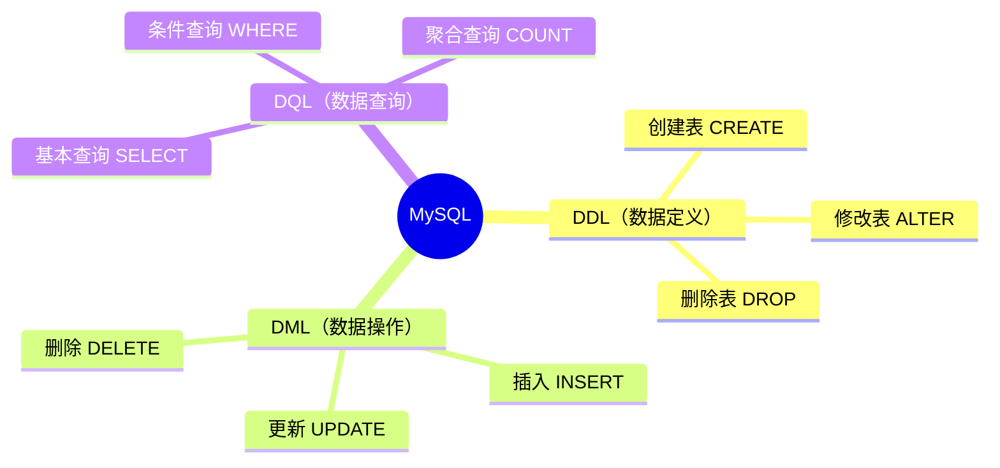
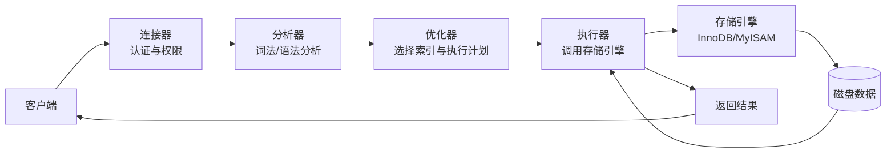
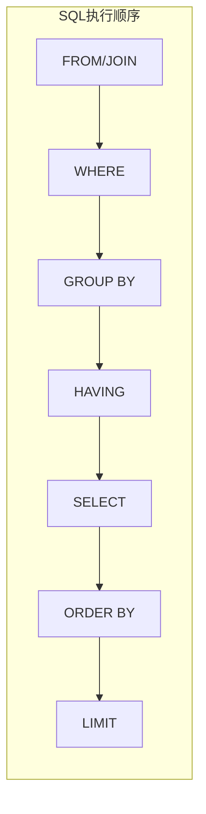

## SQL 概述

SQL（Structured Query Language）是操作关系型数据库的标准语言。按功能分为三大类：DDL（数据定义）、DML（数据操作）、DQL（数据查询）。



---

## SQL 语句执行流程

一条 SQL 在 MySQL 中从发起到返回结果，经历以下步骤：

```
客户端 → 连接器（认证权限）→ 分析器（词法/语法分析）
→ 优化器（选择索引）→ 执行器（调用引擎）→ 存储引擎 → 磁盘
```



---

## DDL（数据定义语言）

用于创建、修改、删除数据库和表结构。

```sql
-- 创建表
CREATE TABLE users (
    id INT PRIMARY KEY,
    name VARCHAR(50)
);

-- 修改表
ALTER TABLE users ADD COLUMN age INT;

-- 删除表
DROP TABLE users;
```

---

## DML（数据操作语言）

对表中数据进行增、删、改。

```sql
-- 插入数据
INSERT INTO users VALUES(1, '张三');

-- 更新数据
UPDATE users SET name = '李四' WHERE id = 1;

-- 删除数据
DELETE FROM users WHERE id = 1;
```

---

## DQL（数据查询语言）

### SELECT 语句的执行顺序

SQL 查询语句的逻辑执行顺序与书写顺序不同：



```sql
-- 基本查询
SELECT * FROM users;

-- 条件查询
SELECT * FROM users WHERE age > 18;

-- 聚合查询
SELECT COUNT(*) FROM users;
```

---

## 总结

- **DDL** 管结构（建表、改表、删表）
- **DML** 管数据（增、改、删）
- **DQL** 管查询（SELECT 的各种花样）
- SQL 执行流程：客户端 → 连接器 → 分析器 → 优化器 → 执行器 → 存储引擎
